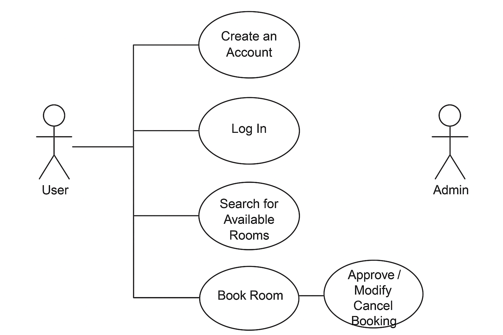

# Requirement Analysis in Software Development

## Introduction  

This repository explores the concept of **Requirement Analysis**, a critical phase in the **Software Development Lifecycle (SDLC)**.  
The goal is to understand how requirements are gathered, analyzed, and validated to ensure that software products meet business and user needs effectively.  
By the end of this project, you’ll have a structured overview of the process, activities, and tools used in requirement analysis.

---

## What is Requirement Analysis?  

**Requirement Analysis** is the process of identifying, gathering, and documenting what a software system should do. It involves understanding the needs of stakeholders and transforming them into clear, actionable, and testable requirements.  

### Importance in SDLC:

- It defines **what the system should achieve** before development begins.  
- It ensures **alignment between stakeholders and developers**.  
- It reduces **project risks** by detecting misunderstandings early.  

Requirement Analysis sets the foundation for design, development, testing, and deployment, ensuring that the end product meets user expectations.

## Why is Requirement Analysis Important?  

Requirement Analysis is vital in software development for several key reasons:

1. **Clarity and Understanding**  
   It provides a clear understanding of what the client wants, ensuring all stakeholders are on the same page before development begins.

2. **Risk Reduction**  
   By identifying potential issues and ambiguities early, teams can prevent costly rework later in the project.

3. **Efficient Resource Management**  
   Well-defined requirements help in accurate estimation of time, cost, and effort required to complete the project.

   ---

## Key Activities in Requirement Analysis  

The process of Requirement Analysis consists of several structured activities that guide how requirements are discovered and refined:

- **Requirement Gathering:**  
  Collecting information from stakeholders through interviews, surveys, and workshops to understand needs and expectations.  

- **Requirement Elicitation:**  
  Engaging stakeholders to extract detailed and hidden requirements through techniques like brainstorming and use case discussions.  

- **Requirement Documentation:**  
  Recording requirements in a structured and clear manner using documents like SRS (Software Requirements Specification).  

- **Requirement Analysis and Modeling:**  
  Analyzing gathered data to remove conflicts and redundancies, and using models such as use case diagrams or data flow diagrams for better visualization.  

- **Requirement Validation:**  
  Ensuring the documented requirements are accurate, complete, and aligned with stakeholder intentions before proceeding to design and implementation.

  ---

## Types of Requirements  

### 1. Functional Requirements  

Functional requirements define **what the system should do** — the specific behavior or functions of the system.  

**Examples (Booking Management System):**  

- Users should be able to **create an account and log in**.  
- The system should allow users to **search for available rooms** based on date and location.  
- The system should **process payments** securely for bookings.  
- Admins should be able to **approve, cancel, or modify bookings**.  

### 2. Non-functional Requirements  

Non-functional requirements define **how the system should perform** rather than what it should do. These focus on quality attributes like performance, security, and usability.  

**Examples (Booking Management System):**  
- The system should **load search results within 2 seconds**.  
- The system should handle **up to 10,000 concurrent users**.  
- The website must be **mobile responsive and accessible**.  
- All user data should be **encrypted** and stored securely.

---

## Use Case Diagrams  

### What are Use Case Diagrams?  
A **Use Case Diagram** visually represents how users (actors) interact with the system to achieve goals. It helps in identifying system boundaries, actors, and key functionalities.  

### Benefits:  
- Clarifies system scope and interactions  
- Simplifies communication between technical and non-technical stakeholders  
- Serves as a foundation for requirement documentation and testing  

### Example – Booking Management System  
Below is a sample use case diagram representing the booking process for a hotel management system.  

---
